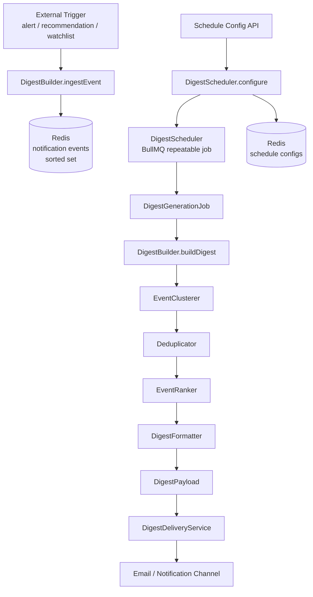

# Design Document: Adaptive Notification Digest

## Overview

The Adaptive Notification Digest Builder replaces per-event individual notifications with intelligently grouped digest messages. The system collects raw notification events (alerts, recommendation changes, watchlist triggers), clusters them by type and vault, deduplicates redundant entries, ranks them by importance, and delivers a single cohesive digest on a user-configured schedule.

The feature is implemented as a set of TypeScript services and BullMQ jobs within the existing `backend/keepers` package, following the same patterns established by `MigrationCostOptimizer`, `CompoundWorker`, and the existing queue infrastructure.

### Key Design Decisions

- **In-process storage via Redis**: Notification events and schedule configurations are stored in Redis (already available via `getRedis()`), avoiding the need for a separate database. Events use sorted sets keyed by `walletAddress` for efficient time-range queries.
- **BullMQ for scheduling**: Repeatable jobs handle `daily` and `weekly` schedules. A threshold-check job polls pending event counts for `event_threshold` users.
- **Pure-function pipeline**: `EventClusterer`, `Deduplicator`, and `EventRanker` are stateless pure functions, making them straightforward to property-test with `fast-check`.
- **Strict user-scope isolation**: All pipeline stages accept a `walletAddress` parameter and filter at the earliest possible point (ingestion and retrieval), preventing cross-user data leakage.

---

## Architecture



### Component Responsibilities

| Component | Responsibility |
|---|---|
| `DigestBuilder` | Orchestrates ingestion and digest construction; enforces user-scope isolation |
| `EventClusterer` | Groups events by `(type, vaultId)` within a time window |
| `Deduplicator` | Removes superseded events within each cluster |
| `EventRanker` | Assigns importance scores and sorts events |
| `DigestFormatter` | Produces the structured `DigestPayload` JSON with human-readable summaries |
| `DigestScheduler` | Manages BullMQ repeatable jobs for `daily`/`weekly`/`event_threshold` schedules |
| `DigestDeliveryService` | Renders `DigestPayload` to HTML and dispatches email |
| `DigestGenerationJob` | BullMQ worker that drives the full pipeline for one user |

---

## Components and Interfaces

### DigestBuilder

```typescript
// server/src/services/DigestBuilder.ts

interface IngestResult {
  ok: true;
  eventId: string;
} | {
  ok: false;
  error: { code: 'INVALID_EVENT'; message: string };
}

class DigestBuilder {
  async ingestEvent(event: RawNotificationEvent): Promise<IngestResult>;
  async buildDigest(walletAddress: string, scheduleMode: ScheduleMode): Promise<DigestPayload>;
}
```

### EventClusterer

```typescript
// server/src/services/EventClusterer.ts

function clusterEvents(
  events: NotificationEvent[],
  windowMs: number
): Cluster[];
```

### Deduplicator

```typescript
// server/src/services/Deduplicator.ts

function deduplicateCluster(cluster: Cluster): Cluster;
```

### EventRanker

```typescript
// server/src/services/EventRanker.ts

function rankEvents(clusters: Cluster[]): RankedCluster[];
function computeImportanceScore(event: NotificationEvent): number;
```

### DigestFormatter

```typescript
// server/src/services/DigestFormatter.ts

function formatDigest(
  walletAddress: string,
  scheduleMode: ScheduleMode,
  rankedClusters: RankedCluster[]
): DigestPayload;

function formatSummary(event: NotificationEvent): string;
```

### DigestScheduler

```typescript
// server/src/services/DigestScheduler.ts

interface ScheduleConfig {
  walletAddress: string;
  mode: ScheduleMode;
  deliveryHour?: number;       // 0–23, for daily/weekly
  deliveryDayOfWeek?: number;  // 0–6, for weekly
  eventThreshold?: number;     // 1–100, for event_threshold
}

interface ConfigureResult {
  ok: true;
} | {
  ok: false;
  error: { code: 'INVALID_THRESHOLD' | 'INVALID_CONFIG'; message: string };
}

class DigestScheduler {
  async configure(config: ScheduleConfig): Promise<ConfigureResult>;
  async getConfig(walletAddress: string): Promise<ScheduleConfig | null>;
}
```

### DigestDeliveryService

```typescript
// server/src/services/DigestDeliveryService.ts

interface DeliveryResult {
  ok: true;
} | {
  ok: false;
  error: { code: 'MISSING_EMAIL' | 'DELIVERY_FAILED'; message: string };
}

class DigestDeliveryService {
  async deliver(payload: DigestPayload): Promise<DeliveryResult>;
  renderHtml(payload: DigestPayload): string;
}
```

### DigestGenerationJob (BullMQ Worker)

```typescript
// server/src/jobs/DigestGenerationJob.ts

interface DigestJobData {
  walletAddress: string;
  scheduleMode: ScheduleMode;
  triggeredAt: string; // ISO 8601
}

class DigestGenerationJob {
  readonly worker: Worker<DigestJobData>;
  async process(job: Job<DigestJobData>): Promise<void>;
}
```

---

## Data Models

### NotificationEvent (union type)

```typescript
type EventType = 'alert' | 'recommendation' | 'watchlist';

interface BaseNotificationEvent {
  eventId: string;          // UUID v4
  eventType: EventType;
  walletAddress: string;
  recordedAt: string;       // ISO 8601
}

interface AlertEvent extends BaseNotificationEvent {
  eventType: 'alert';
  vaultId: string;
  condition: string;
  thresholdValue: number;
  triggeredAt: string;      // ISO 8601
  currentMetricValue?: number;
}

interface RecommendationEvent extends BaseNotificationEvent {
  eventType: 'recommendation';
  sourceStrategyId: string;
  destinationStrategyId: string;
  previousDecision: Decision;
  newDecision: Decision;
}

interface WatchlistEvent extends BaseNotificationEvent {
  eventType: 'watchlist';
  vaultId: string;
  conditionDescription: string;
  triggeredAt: string;      // ISO 8601
  vaultHealthScore?: number;
}

type NotificationEvent = AlertEvent | RecommendationEvent | WatchlistEvent;
type Decision = 'MIGRATE' | 'HOLD' | 'DEFER';
```

### Cluster

```typescript
interface Cluster {
  clusterKey: string;       // "{eventType}:{vaultId}" or "{eventType}:{sourceStrategyId}:{destinationStrategyId}"
  eventType: EventType;
  vaultId?: string;
  events: NotificationEvent[];
}
```

### RankedCluster

```typescript
interface RankedCluster extends Cluster {
  topImportanceScore: number;
  summary: string;
}
```

### DigestPayload

```typescript
interface DigestPayload {
  walletAddress: string;
  generatedAt: string;      // ISO 8601
  scheduleMode: ScheduleMode;
  clusters: RankedClusterEntry[];
}

interface RankedClusterEntry {
  eventType: EventType;
  vaultId?: string;
  topImportanceScore: number;
  eventCount: number;
  summary: string;
}

type ScheduleMode = 'daily' | 'weekly' | 'event_threshold';
```

### Redis Key Schema

| Key Pattern | Type | Contents |
|---|---|---|
| `digest:events:{walletAddress}` | Sorted Set | Serialized `NotificationEvent` JSON, scored by `triggeredAt` ms |
| `digest:schedule:{walletAddress}` | Hash | `ScheduleConfig` fields |
| `digest:audit:{walletAddress}` | List | ISO 8601 timestamps of triggered digest generations |

### BullMQ Queue Names

```typescript
// Added to existing QUEUE_NAMES in queues/types.ts
DIGEST_GENERATION: 'digest-generation',
DIGEST_THRESHOLD_CHECK: 'digest-threshold-check',
```

---

## Correctness Properties

*A property is a characteristic or behavior that should hold true across all valid executions of a system — essentially, a formal statement about what the system should do. Properties serve as the bridge between human-readable specifications and machine-verifiable correctness guarantees.*

### Property 1: Event ingestion preserves all required fields

*For any* valid notification event (alert, recommendation, or watchlist), after ingestion the persisted record SHALL contain a non-empty unique `eventId`, the correct `eventType`, the original `walletAddress`, and a valid ISO 8601 `recordedAt` timestamp.

**Validates: Requirements 1.1, 1.2, 1.3, 1.4**

### Property 2: Missing walletAddress is always rejected

*For any* notification event payload where `walletAddress` is absent, empty, or null, the ingestion call SHALL return `ok: false` with error code `INVALID_EVENT`.

**Validates: Requirements 1.5**

### Property 3: Cluster count equals distinct (type, vaultId) pairs

*For any* non-empty set of notification events belonging to a single user, the number of clusters produced by `EventClusterer` SHALL equal the number of distinct `(eventType, clusterKey)` pairs in the input set.

**Validates: Requirements 2.1, 2.6**

### Property 4: Clustering preserves total event count

*For any* set of notification events, the sum of event counts across all output clusters SHALL equal the count of input events (no events are lost or duplicated during clustering).

**Validates: Requirements 2.5**

### Property 5: Deduplication never increases event count

*For any* cluster of notification events, the count of events output by `Deduplicator` SHALL be less than or equal to the count of events in the input cluster.

**Validates: Requirements 3.5**

### Property 6: Deduplication retains only the most recent duplicate

*For any* cluster containing multiple events that share the same deduplication key (condition+vaultId for alerts, strategy pair for recommendations, vaultId+condition for watchlist), the output SHALL contain exactly one event for that key, and it SHALL be the one with the latest `triggeredAt` timestamp.

**Validates: Requirements 3.1, 3.2, 3.3**

### Property 7: Distinct events are never removed by deduplication

*For any* cluster where all events differ in at least one of `condition`, `vaultId`, or `eventType`, the output of `Deduplicator` SHALL contain the same number of events as the input.

**Validates: Requirements 3.4**

### Property 8: Importance scores are always in [0, 100]

*For any* notification event, the `Importance_Score` assigned by `EventRanker` SHALL be a number in the closed interval [0, 100].

**Validates: Requirements 4.1**

### Property 9: Digest payload importance scores are non-increasing

*For any* `DigestPayload`, the sequence of `topImportanceScore` values across the ordered cluster entries SHALL be non-increasing from first to last.

**Validates: Requirements 4.5, 4.7**

### Property 10: User scope isolation

*For any* set of notification events belonging to multiple distinct wallet addresses, a `DigestPayload` generated for wallet address W SHALL contain only events whose `walletAddress` exactly equals W — no events from any other wallet address SHALL appear.

**Validates: Requirements 7.1, 7.2, 7.5**

### Property 11: Threshold validation rejects out-of-range values

*For any* `event_threshold` schedule configuration where `eventThreshold` is less than 1 or greater than 100, the `DigestScheduler.configure` call SHALL return `ok: false` with error code `INVALID_THRESHOLD`.

**Validates: Requirements 8.2, 8.3**

### Property 12: DigestPayload JSON round-trip

*For any* valid `DigestPayload`, serializing it to JSON with `JSON.stringify` and then deserializing with `JSON.parse` SHALL produce an object that is deeply equal to the original payload.

**Validates: Requirements 6.7**

### Property 13: Summary strings contain all interpolated values

*For any* alert event, the formatted summary string SHALL contain the `condition`, `thresholdValue`, and `vaultId` values. *For any* recommendation event, the summary SHALL contain `previousDecision`, `newDecision`, `sourceStrategyId`, and `destinationStrategyId`. *For any* watchlist event, the summary SHALL contain `conditionDescription` and `vaultId`.

**Validates: Requirements 6.3, 6.4, 6.5**

---

## Error Handling

### Ingestion Errors

| Scenario | Error Code | Behavior |
|---|---|---|
| Missing `walletAddress` | `INVALID_EVENT` | Reject event, return error, do not persist |
| Invalid event type | `INVALID_EVENT` | Reject event, return error |
| Redis write failure | — | Propagate exception; caller handles retry |

### Scheduling Errors

| Scenario | Error Code | Behavior |
|---|---|---|
| `eventThreshold` outside [1, 100] | `INVALID_THRESHOLD` | Reject config, return error |
| Invalid `mode` value | `INVALID_CONFIG` | Reject config, return error |
| BullMQ job registration failure | — | Log error, propagate exception |

### Delivery Errors

| Scenario | Error Code | Behavior |
|---|---|---|
| No registered email for `walletAddress` | `MISSING_EMAIL` | Abort delivery, log error, do not send |
| Email send failure | `DELIVERY_FAILED` | Log error, allow BullMQ retry via job attempts |

### Empty Digest Handling

When `DigestBuilder.buildDigest` is called for a user with no pending events, it returns a `DigestPayload` with an empty `clusters` array. `DigestGenerationJob` checks for this and skips delivery, recording a skip entry in the audit log.

---

## Testing Strategy

### Property-Based Testing (fast-check)

The project already uses `fast-check` (v4.7.0) for property-based tests (see `MigrationCostOptimizer.test.ts`). All correctness properties above will be implemented as `fast-check` property tests with a minimum of **100 iterations** each.

Each test is tagged with:
```
// Feature: adaptive-notification-digest, Property N: <property text>
```

**Properties to implement as PBT:**

| Property | Target Function | Generator Strategy |
|---|---|---|
| P1: Event ingestion preserves fields | `DigestBuilder.ingestEvent` | `fc.oneof(alertEventArb, recommendationEventArb, watchlistEventArb)` |
| P2: Missing walletAddress rejected | `DigestBuilder.ingestEvent` | `fc.record(...)` with `walletAddress: fc.constant('')` or `fc.constant(null)` |
| P3: Cluster count = distinct pairs | `clusterEvents` | `fc.array(notificationEventArb, { minLength: 1 })` |
| P4: Clustering preserves count | `clusterEvents` | `fc.array(notificationEventArb)` |
| P5: Deduplication never increases count | `deduplicateCluster` | `fc.array(notificationEventArb, { minLength: 1 })` |
| P6: Deduplication retains most recent | `deduplicateCluster` | Clusters with generated duplicate events |
| P7: Distinct events preserved | `deduplicateCluster` | Clusters with all-distinct events |
| P8: Scores in [0, 100] | `computeImportanceScore` | `fc.oneof(alertEventArb, recommendationEventArb, watchlistEventArb)` |
| P9: Non-increasing score sequence | `rankEvents` + `formatDigest` | `fc.array(notificationEventArb, { minLength: 1 })` |
| P10: User scope isolation | `DigestBuilder.buildDigest` | `fc.array(notificationEventArb)` with mixed walletAddresses |
| P11: Threshold validation | `DigestScheduler.configure` | `fc.integer().filter(n => n < 1 \|\| n > 100)` |
| P12: JSON round-trip | `JSON.stringify` / `JSON.parse` on `DigestPayload` | `fc.record(digestPayloadArb)` |
| P13: Summary string interpolation | `formatSummary` | `fc.oneof(alertEventArb, recommendationEventArb, watchlistEventArb)` |

### Unit Tests

Unit tests cover specific examples, edge cases, and integration points:

- **Schedule modes**: One test per mode (`daily`, `weekly`, `event_threshold`) verifying correct BullMQ job creation
- **Empty event set**: Verify digest generation is skipped without error when no pending events exist
- **MISSING_EMAIL delivery abort**: Verify `DigestDeliveryService` logs error and does not send when no email is registered
- **Schedule update**: Verify old BullMQ job is cancelled and new job is registered when schedule is updated
- **Tiebreaker ordering**: Events with equal importance scores are ordered by `triggeredAt` descending
- **Recommendation score direction**: `HOLD→MIGRATE` transition scores higher than `MIGRATE→HOLD`
- **HTML rendering**: `DigestDeliveryService.renderHtml` produces valid HTML containing payload data

### Coverage Target

90% line coverage across all files in `services/` and `jobs/` directories related to the digest feature (Requirement 9.1).
